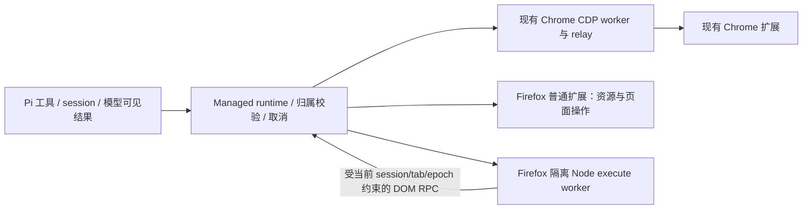

# 普通 Firefox 扩展执行计划

日期：2026-09-12。状态：执行中；本文描述目标、接口、分工与验收条件，不表示已交付。

## 已确定的产品范围

用户已选普通 Firefox WebExtension：现有 Pi + 本地 runtime 安装基础上，装扩展后接管已经打开的真实标签、登录态、表单和滚动。不得依赖 Remote Agent、BiDi、Marionette、调试启动参数、另一个自动化浏览器、修改用户设置或特权扩展。尽可能复刻当前 Chrome 的全部结构化工具，并实现常用 Playwright 风格 execute；平台差异明确进入文档、profile 能力和模型可见响应。

用户本轮授权完成执行文档、建立独立 worktree、多 Agent 实现、全新 Agent 验收、整合提交和提交 PR。各实现 Agent 只能提交自己的文件，由协调者整合；PR base 为 dev。不发布 npm/商店、tag 或 Release，不直接合 main。未验收项目不能通过文字称为支持。

Rust 作为后续独立迁移边界。本批次保留 Pi TS 和隔离 Node 执行环境，优先完成 Firefox 功能及兼容；不把没有性能基线的全 Rust 重写作为前置依赖。

## 架构与边界



1. `playwriter/src/browser-protocol.ts` 仍是唯一共享编译契约。先落协议，再并行实现。
2. Chrome 不迁移到新执行后端。缺省 backend 仍为 CDP，旧扩展不发送任何新字段时行为不变。
3. Firefox 用独立 background/build 入口，共享真实的纯逻辑模块；不通过伪造 CDP 让 Chromium Playwright 误认 Firefox。
4. 跨源 frameLocator 使用 Firefox `runtime.getFrameId(iframeElement)` 取得权威 frameId，再通过 frameIds 定向执行；背景复核当前 tab/epoch 的 frame。不得通过 URL、顺序或页面可伪造的 nonce 关联。该 ID 查询只发生在可信静态脚本，不暴露给动态用户代码。普通结构化 page 操作直接经现有扩展 WS 路由，扩展重新核验 session/tab/epoch。`page.execute` 在独立 Node 子进程中执行，页面 RPC 每次都校验当前归属和租约。JS 无限循环不得卡住 runtime。
5. Firefox 使用 Manifest V3 background scripts，基本 DOM 操作通过 `scripting.executeScript` 注入打包脚本并调用静态函数，无须刷新。基本目标为桌面 Firefox 139+。动态 `evaluate` 只在 `userScripts.execute` 的 USER_SCRIPT 沙箱执行，绝不在能访问 WebExtension API 的内容脚本世界运行模型代码，也不开启用户脚本 messaging。该即时 API 自 Firefox 153 起；用户通过扩展弹窗授权可选 userScripts 权限后启用。较旧版本/未授权时，其余结构化工具与 execute 的非 evaluate 方法仍可用，只对 evaluate 返回具体不支持提示。evaluate 世界能访问 DOM，但不能访问扩展 storage/runtime，也不声称与页面 MAIN 世界相同。不得放宽 CSP 或改用特权入口。
6. 实现核验发现原 MV2 动态 tabs.executeScript 会暴露扩展权限，已采用以上 MV3 沙箱路线。原生依据：[userScripts](https://developer.mozilla.org/en-US/docs/Mozilla/Add-ons/WebExtensions/API/userScripts)、[execute](https://developer.mozilla.org/en-US/docs/Mozilla/Add-ons/WebExtensions/API/userScripts/execute)、[Firefox153兼容数据](https://raw.githubusercontent.com/mdn/browser-compat-data/main/webextensions/api/userScripts.json)。对外最低版本与每项能力分开判断。
7. 打包为独立 Firefox 目录与本地 ZIP/XPI 候选。临时加载用于开发验收，正式 Firefox 安装仍要求 AMO 签名；本轮不申请签名或宣称商店已发布。

## 兼容契约冻结

- `BrowserCapabilities` 仅追加可选 `backend`、`inputMode`、`snapshotMode`、`executeMode`、`evaluateWorld` 和 `limitations`。profile 返回实际后端能力，Chrome 缺省值保留。
- `BrowserInventory` 追加可选 backend 与 capabilities；扩展是事实来源，runtime 只验证并缓存。Firefox inventory 必须明确 backend=webextension。
- `BrowserTab` / candidate 追加可选 `browserTabId`；group 可追加 `browserGroupId`。现有必填 `chromeTabId` 保留，Firefox 使用明确的不可用标记 -1，同时提供真实 browserTabId；不得把它当有效 Chrome ID。ready Chrome 的 CDP 校验不变；ready Firefox 必须有匹配的真实 browserTabId，且不能伪造 targetId/cdpSessionId。
- 老 candidate 格式与 builder 保留。新增 Firefox candidate 前缀和统一解析 helper，把 profile + epoch + 真实 browserTabId 一起固定；不能按 URL、标题或数组位置关联。
- `BrowserDomRequest` / `BrowserDomCommand` 在共享协议中定义，使用独立 `browserDomRequest` 内部消息。请求包含 requestId/sessionId/tabId/browserEpoch，command 为受控命令和序列化 locator 描述；不得由 execute 提供另一个 session 或 tab。
- 浏览器返回值统一转为 BrowserJson。扩展返回 images；本地 runtime 验证绝对 path 后负责文件保存与 artifact（与现有 Chrome 一致），扩展不能访问本地文件系统。
- 所有新增运行时 parser 都做字段、范围和大小验证；拒绝未知或不支持的操作。不得削弱 Chrome 的旧校验来接受 Firefox 数据。

## 目标功能与差异

| 功能 | 本批次目标 | 明示边界 |
| --- | --- | --- |
| profiles / groups | list 与具名组 create/rename/close；profile 与 session 隔离 | 原生组 API 可用时使用；逻辑组始终明确，不自动接管用户同组其它标签 |
| tabs | list/create/discover/attach/activate/close/release | attach 原地，不刷新、不搬窗口；release 不关闭用户页；真实关闭只由 close 触发 |
| 生命周期 | epoch/revision/tombstone 持久化与重连，sourceTabId | 浏览器重启不可沿用旧物理 ID；恢复需验证，不能复活 release |
| navigate/back | HTTP(S) 导航与真实历史 | 按显式 tabId，受限页面在动作前拒绝 |
| snapshot | DOM/ARIA 快照、short ref、snapshotId、selector/search/full/interactiveOnly | 与 Chrome 原生 AX 树存在差异；使用可访问名称算法；ref 必须固定元素与文档代际 |
| click/fill | strict CSS/role/ref；可见性、禁用、遮挡等可实现的检查；表单与 contenteditable | DOM 输入不等价浏览器原生输入；不伪造 trusted 事件、不扩大控制范围来绕错误 |
| evaluate | async JavaScript、显式 return、BrowserJson、错误与超时 | 153+ USER_SCRIPT 沙箱与可选权限；页面 MAIN 全局对象可访问范围明确；基本 DOM 世界 refs 在执行前后保守失效 |
| screenshot | 显式 tabId，viewport/fullPage，labels，inline image + 可选 path | Firefox captureTab/rect；不滚动拼接损坏页面；页面尺寸等失败如实报告 |
| network | start/list/stop、状态、保留与容量限制，尽可能正文 | 只处理可绑定受控 tab 的事件；stream/body 受限时明确字段，不伪造完整 response |
| logs | 接管后的 console/error/rejection 可用内容与有界缓冲 | 接管前日志不保证；注入和页面执行世界差异明确 |
| execute | 隔离进程，page/locator 常用 API、state、console、snapshot helper | CSS/getByRole/getByText/getByLabel 等；click/fill/check/selectOption/press 等尽量覆盖；CDP、浏览器创建/关闭、原生输入等未支持接口明确拒绝 |
| Pi 呈现 | browser/profile 能力、执行与输入差异、具体失败提示 | 进入 model-facing content；不重复刷长警告；常规页面操作保留统一工具 |

最大能力复刻以可验证的正确性为前提。实现者遇到平台能力缺口，需提交具体 API 证据与最小失败场景，由协调者调整能力矩阵；不得为了尽快完成而把整类功能直接关闭。

## Worktree 与文件 owner

所有实现 worktree 位于本仓库 `tmp/firefox-implementation/`；从同一个协议基础提交创建，工作分支前缀 codex/。各树先执行 pnpm bootstrap 和 runtime build，不修改已运行的 Pi/runtime/扩展。只允许一个 owner 修改同一逻辑文件；跨边界通过消息协调。

| 单元 | owner 工作范围 | 交付与检查 |
| --- | --- | --- |
| 协调者 / integration | 总计划、唯一协议基础、整合、最终文档、changeset 汇总、PR | 协议先冻结；协调测试串行；修跨包集成问题 |
| runtime Agent | managed-relay.ts、cdp-relay.ts、相应真实协议/WS 测试 | Firefox origin/握手、backend inventory、page 路由、取消、网络分流、artifact 保存；Chrome 回归 |
| Firefox resources Agent | extension/src/firefox-background.ts、firefox-resources.ts、firefox-api.ts 及相关资源模块 | browser API 类型、资源归属与持久化、WS、request ledger、导航/截图/network/logs 与 DOM driver 集成 |
| Firefox DOM Agent | extension/src/firefox-dom.ts 与专属 helper | 页面注入、selector/ARIA/ref、click/fill、evaluate、DOM locator commands；真实 DOM逻辑验证与 fixture |
| Firefox execute Agent | playwriter/src/firefox-executor*.ts 与专属测试 | 独立子进程、限定 page/locator facade、state/console、DOM RPC、取消与生命周期 |
| Pi / distribution Agent | pi/、extension 构建脚本/manifest、root package scripts、runtime extension bundle script、打包脚本 | 能力显示、文档、Firefox build/package、manifest 版本、CI构建覆盖；不得改其它 owner 模块 |
| 全新验收 Agent | 只读整合提交；独立 acceptance 报告 | 真实运行测试与源码 review，指出问题交还 owner，复核修复后验收 |

类型基础由协调者完成后发给各 owner。后续需要共享类型变更只能通知协调者落一次，再 cherry-pick 同一提交，避免每树各写一份协议。

## 执行阶段

1. 完成并提交本文和研究记录；建立 integration worktree，基于 origin/dev。已有研究分支与用户未跟踪文件保留。
2. 在 integration 落兼容协议基础并 typecheck，创建分工 worktree。发布模块接口和 owner，不边实现边猜消息形状。
3. 各 Agent 自己 bootstrap、build、实现、检查与提交；向协调者回报 commit、真实 PASS/FAIL/SKIP 和边界。网络/端口测试集中串行授权，不跨树并跑。
4. 协调者逐分支整合。集成后执行完整浏览器无关检查、Chrome build/package、Firefox build/package，核对实际产物与模型输出。
5. 派未参与实现的新 Agent 进行独立审查和验收，所有实质发现修复并复验。
6. 浏览器阶段在产物具体可加载后通知用户准备并取得加载/运行授权；仅测试本次 Firefox 场景和必要 Chrome 回归。未经准备不启动/重启用户浏览器、不安装扩展、不起临时后台服务。
7. 形成最终能力矩阵、验收记录与提交。推送整合 feature branch 并创建 base=dev 的 PR；浏览器验收未完成时 PR 保持 draft，明确未验收事项，不把它称为可合并。完整验收后更新 PR 状态。合并指实现分支整合，不直接合 main；发布仍需另行明确授权。

## 检查与验收

以下命令按顺序在 integration 执行；测试命令不设置低于 300 秒的进程超时，工具 yield 仅用于流式读取不是终止超时。

```bash
pnpm --filter @tom-cat/pi-browser-runtime typecheck
pnpm --filter @tom-cat/pi-browser-runtime test:unit --run
pnpm --filter @tom-cat/pi-browser-runtime test:integration --run
pnpm --filter mcp-extension test --run
pnpm --filter mcp-extension exec tsc --project .
pnpm --filter @tom-cat/pi-browser-use-extension test --run
pnpm --filter @tom-cat/pi-browser-use-extension typecheck
pnpm --filter @tom-cat/pi-browser-use-extension load-check
pnpm build
pnpm package:extension
```

Firefox build/package 命令由 distribution owner 落为非交互脚本；不自动加载。新增测试使用真实纯逻辑、DOM fixture、进程/WS；不新增 mock、不写镜像实现的占位测试，不运行默认会启动 Chrome 的 pnpm test。

浏览器验收最小矩阵：

- 同 URL 的两个已开标签、多窗口和两个 Pi session：归属不能混淆。
- attach 前已有输入/滚动保持；discover 只读元数据；release 后连接重建不复活。
- 新文档/动态 DOM 后 refs 失效；零/多 selector 匹配报错；evaluate/execute 后拒绝旧 snapshot。
- 普通与受控 input、textarea、contenteditable、checkbox/select、链接与新标签、iframe/open shadow DOM。
- 导航/back/activate 指定页面；新标签 sourceTabId；切 tab 不改变另一个 session。
- 截图 viewport/fullPage/labels，文件保存，网络 start/stop/保留/容量，console/error。
- execute JS 循环、串行 locator、返回值、state、错误、超时和取消；不能跨 tab、不能在取消后再执行排队动作。
- runtime/扩展断开与重连、同 epoch 与新 epoch、重复 requestId。
- Chrome 旧库存/请求解析、现有 CDP 路径、Chrome 构建产物身份与默认19989不退化。

## 完成标准与记录

完成需具备：可构建的 Firefox 普通扩展、上述结构化工具的实际实现、明确的 execute 支持表、兼容旧 Chrome 的自动检查、独立 review，以及有事实记录的浏览器验收。失败项有根因与修复；平台做不到的能力有具体提示。不能将未运行测试标 PASS。

实施期间此文保留目标语气；最终交付范围另写 acceptance 记录。新增公共行为写 changeset；不手改公共包版本/CHANGELOG。Firefox 发布身份与签名状态只写事实，不冒用 Chrome/上游商店 ID。
