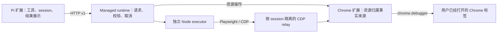

# Firefox 支持与 Rust 介入可行性研究

研究日期：2026-09-12。仓库基线：`1fa533d665328a5b73ed95062a37f751485f6c11`；Playwright 子模块：`2074cbb1d4d3ce9274ec10c7d7834d4a7aba1d64`。

本文件是本次任务的研究记录，不是已交付功能或新的长期开发指引。依据为当前代码、Mozilla/MDN 等官方资料及库的真实源码；本轮没有修改实现、安装扩展、启动浏览器或运行浏览器验收。

## 结论与需求边界

用户明确要求：**和 Chrome 一样，装扩展后直接接管已打开的标签。** 这里沿用项目已有的 Pi + 本地 runtime 前提，浏览器保留现有 profile、登录态、页面、滚动及表单；不能将首次配置调试参数、重启或另开自动化浏览器视为满足要求。

- **Firefox 原地操作普通网页的扩展可以做。** WebExtensions 的 tabs、scripting、截图等 API 提供了基础，但需要新增 Firefox 执行后端。
- **依靠普通 Firefox 扩展，不能承诺当前 Chrome 工具集和操作语义的完整等价。** 首要差距是 Firefox 没有 `chrome.debugger` 等价公共 API。DOM 脚本点击与浏览器输入事件不同，当前 CDP 原生无障碍树与 Playwright 执行层也不能直接搬过去。[S1][S2][S5]
- **WebDriver BiDi 是完整自动化方向的重要候选，但它不满足本次安装体验要求。** Firefox Remote Agent 的公开启用路径要求启动参数；普通扩展不能给一个未启用调试的运行实例补开入口。[S3]
- **Rust 可以独立推进。** 它适合本地 runtime、协议处理或经过测量确认的计算热点；不会改变 Firefox 的扩展权限，也不能仅凭换语言承诺端到端提速。

因此当前可选的产品方向是：保持现有完整体验并暂不宣称 Firefox 支持，或者另行确认一个明确列出能力差异的 Firefox 扩展版本。两者不应通过静默降级混在一起。

## 当前项目实际架构



项目已经超出“把 Playwriter 包一下”的程度。Pi 端有稳定工具契约，扩展维护资源归属，runtime 校验隔离与取消，worker 承载受约束的 Playwright 执行。

| 边界 | 代码证据 | 对 Firefox 的含义 |
| --- | --- | --- |
| Pi 与 runtime | `pi/extensions/runtime-client.ts`；`playwriter/src/browser-protocol.ts` | HTTP 操作与结果模型可以保留；Pi 不必直接认识 CDP/BiDi |
| 资源归属 | `extension/src/resource-registry.ts`；`managed-groups.ts:1140` | session/profile/group/tab、epoch、revision、release tombstone 必须延续 |
| 现有标签接管 | `extension/src/managed-groups.ts:1245`；`background.ts:1471` | 接管最终调用 `chrome.debugger.attach`，不是单纯记录 tab ID |
| 执行连接 | `playwriter/src/managed-executor-worker.ts:292` | 当前固定 `chromium.connectOverCDP` |
| 页面身份 | `playwriter/src/managed-executor-worker.ts:345` | 用 fork 的 `page.targetId()` 登记页面，不能换协议后继续假设这个值存在 |
| 快照 | `playwriter/src/aria-snapshot.ts:1245`、`:1271` | 使用 `DOM.getFlattenedDocument` 与 `Accessibility.getFullAXTree`，不是通用 DOM 文本导出 |
| 归属检查 | `playwriter/src/managed-relay.ts:2995` | 校验 CDP target/session 与命令范围；新后端也必须检查命令和事件的归属 |
| execute | `playwriter/src/managed-executor-facade.ts:74` | 是受约束的 Playwright 对象接口，不能把普通页面 JS 注入当作等价替换 |

`BrowserTab` 当前仍要求 `chromeTabId`，执行参数包含 `cdpUrl`。这说明公共上层已经有抽象基础，底层绑定仍需拆分，不能只改浏览器名称或 manifest。

## Firefox 平台的确定事实

### 普通扩展不能直接替代 chrome.debugger

MDN 的 Chrome incompatibilities 明确写道：

> In Firefox: Chrome's debugger API is not implemented.

Chrome 的官方说明则把 `chrome.debugger` 定义为 CDP 的扩展侧传输入口，能按 `tabId` attach/sendCommand/收事件。[S1][S2]

Firefox 的 DevTools 扩展 API、Firefox 自己的 DevTools 调试协议，以及 WebDriver BiDi 是不同入口。不能因为存在 DevTools 或 `browser` 命名空间，就推导出普通扩展有一个 `browser.debugger`。本轮搜索生成摘要实际出现了这样的错误样例，已排除，不作为实现依据。

### BiDi 可以控制 Firefox，但需要已有调试入口

Firefox Remote Agent 的 Security 文档明确说 listener 只能通过 `--remote-debugging-port` 启动，并写明没有其他启用机制。该文档描述了模拟点击/输入、脚本、网络和日志等能力。[S3]

已有调试实例与普通运行实例必须区分：如果用户原本就以调试方式运行 Firefox，客户端可以研究连接它；如果用户只是正常打开 Firefox 后再装扩展，这个前提没有成立。

geckodriver 的 `--connect-existing` 也明确要求现有实例已启用 Marionette。它不是免配置的接管方案。[S4]

Firefox 的旧 CDP 支持也不应成为新路线基础。当前 Prefs 文档说明 CDP 支持结束后只剩 BiDi，`remote.active-protocols` 偏好在 Firefox 141 移除。[S17]

### 特权 API 是条件路线

Firefox 支持内建 WebExtensions API 和 privileged extension experiments，能触达普通扩展之外的浏览器能力。但 Mozilla 文档明确：out-of-tree privileged 扩展不能通过普通 addons.mozilla.org 签名，需要另一条 privileged certificate 流程。[S10]

因此它只能作为与 Mozilla 或具体 Firefox 发行版合作的架构选项。Nightly/Developer Edition 的开发配置、定制浏览器、放开实验 API 等，都不属于普通用户只装扩展的通用方案。本研究没有验证某个 Firefox fork 已提供这样的接口。

## 普通 Firefox 扩展可达到的能力

以下“可做”表示官方 API 提供实现基础，不代表本项目已实现或跨版本验收通过。

| 当前能力 | 普通 Firefox 扩展路径 | 能力差异或待验证内容 |
| --- | --- | --- |
| profiles、具名逻辑 group、显式 tab ID | 扩展生成 profile 身份，tabs/windows + 持久化 registry | Firefox containers 是额外维度，不能当成安装 profile；不得改变既有归属模型 |
| discover/attach/release | tabs.query + 按 tabId 注入与登记；release 撤销该标签的控制归属并记录 tombstone | 可以保留页面原状；attach 成功必须以实际可操作为条件，不只是创建记录 |
| 创建/激活/关闭标签与浏览历史 | tabs API；有版本基础的 tabGroups API | MDN 兼容数据标注 Firefox 桌面 tabGroups 自 139 起；ESR/forks 逐版本核验 [S8] |
| 页面读取、常见 DOM 操作 | scripting.executeScript/content scripts | host 权限、受限页面、iframe 的部分注入结果必须显式处理 [S6] |
| 页面 JS evaluate | MAIN world 或适当的 userScripts 路径 | 新版 userScripts 有额外可选权限；需核验执行世界、CSP、序列化与 async return，不能简单说“完全不能 evaluate” [S6][S7] |
| snapshot、role/CSS/ref | 复用适合浏览器内执行的 selector/可访问名称算法，另做快照与 ref registry | DOM 推导树与当前 CDP 原生 AX 树不同；strict、snapshotId、失效规则仍需完整实现 |
| 点击、填充、拖拽等交互 | DOM click、赋值、分发事件可覆盖部分表单 | `HTMLElement.click()` / `dispatchEvent()` 的事件不能当作浏览器真实输入等价物；控件行为、pointer/keyboard 序列与用户激活语义需实测 [S5] |
| 截图 | Firefox tabs.captureTab(tabId, options) | 支持显式标签；ImageDetails 有页面区域 rect/scale。不能错误地限制为只有活动标签截图；整页、大页面、后台及标签叠层需验证 [S9] |
| 网络采集 | webRequest + host 权限 | 可监听生命周期，响应正文需另外验证；无法绑定真实 tab 的事件不能猜归属。不能直接等同 Playwright response 对象和现有采集语义 [S11] |
| console/logs | 页面注入观察或适当的浏览器 API | 接管前日志、不同执行世界和页面对注入代码的干预都需定义；不能默认完整兼容 |
| browser_execute | 在本地保留 JS 执行入口，逐项实现受控对象 | 普通 DOM 后端不会自然得到当前 Playwright API；不支持的方法必须明确拒绝 |

一个可接受的“受限版本”需要用户重新确定上述差异是否足够满足使用场景。本次用户已确认安装方式，没有授权将全部能力静默缩减。

## 方案对照

| 路线 | 装扩展后接管普通已开实例 | 与当前完整体验的关系 | 判断 |
| --- | --- | --- | --- |
| 把 Chrome 扩展直接移植为 Firefox 扩展，继续 CDP | 无等价 debugger 入口 | 当前执行/快照链路无法成立 | 不采用 |
| 普通 WebExtensions + DOM 后端 | 有实现基础 | 常用网页操作可做；输入、AX、execute 等有差异 | 唯一值得按当前安装约束研究的常规路线，但应明确为受限能力 |
| 扩展 + Firefox Remote Agent / BiDi | 仅已启用调试的实例 | 自动化能力较强，仍需适配 | 不满足本次硬要求，保留为另一个产品模式 |
| Puppeteer + BiDi | 同样依赖已启用的 Remote Agent | 库提供 stock Firefox BiDi 接入；不是 Playwright API 的直接替换 | 技术候选，不能解决安装入口 |
| geckodriver / Marionette | 需预启用 Marionette | 可以研究既有实例连接 | 不满足本次硬要求 |
| Rust Native Messaging host | host 本身不提供调试权限 | 解决本地进程通信；安装和授权独立存在 | Rust 介入点，不是 Firefox 权限补丁 |
| 特权扩展 / 发行版内建 API | 取决于发行版与签名机制 | 理论上可提供更完整桥接 | 需要发行版合作，不能宣称通用 Firefox 支持 |
| OS UI 自动化 | 另有 OS 权限、焦点及平台前提 | 缺少同等页面/frame/元素归属与后台操作语义 | 不作为本项目的等价浏览器后端 |

Firefox Stable、ESR、Zen、LibreWolf 等不能只依据“都是 Gecko”一并宣称支持。普通 API 版本、默认权限、扩展生命周期和页面限制须各自检测；本轮没有这些发行版的真实浏览器测试。

## Playwright fork 的复用边界

Playwright 的常规 Firefox 自动化依赖其定制 Firefox 构建；`connect()` 对应 Playwright server 的端点，`connectOverCDP()` 明确只支持 Chromium。这些并不构成普通已开 Firefox 的接管 API。[S12]

当前仓库子模块同时存在实验 BiDi 代码。`firefox/firefox.ts:44` 将 `moz-*` channel 路由到 BidiFirefox，而 `bidi/bidiFirefox.ts:106` 所在启动路径添加远程调试参数。它与常规 Firefox/Juggler 路径是两条后端，不能把“默认 Firefox 使用 patched build”扩大为“所有 BiDi 自动化都需要 patched Firefox”。

当前 BiDi 代码的已有页面枚举和持久化初始化、fork 的 `page.targetId()`、当前原生 AX snapshot，以及 managed relay 的作用域检查都需要专项适配。子模块存在 `bidi/` 目录不代表本产品已具备 Firefox 支持。具体来说，`server/page.ts:327` 的 `targetId()` 只读 Chromium delegate 的 `_targetId`；`bidi/bidiBrowser.ts:86` 的 persistent 初始化主动新建默认页，不能原样用于接管。Playwright 的 DOM ARIA 算法则可借用，但公共 `locator.ariaSnapshot()` 使用 expect 模式，不会自动返回本工具需要的 AI refs。

Puppeteer 的官方文档和 BiDi 实现对 stock Firefox 更直接，可在改变安装前提后作为连接层候选。但必须保留当前产品自己的资源归属、snapshotId、strict 匹配、取消和 outcome 语义，不能依赖库默认的全浏览器枚举。[S13]

不建议为复用 `connectOverCDP` 而承诺实现通用 CDP → BiDi 翻译器。目标与 frame/realm 身份、事件、输入、AX 和网络语义并非逐字段对应；它既增加维护负担，也不解决 Firefox 未开放调试入口的问题。

## Rust 介入建议

### 保留适合 JS 的边界

- Pi 继续用薄 TS 适配层注册工具、注入 session ID 和展示结果。
- 普通扩展的 WebExtensions/DOM 操作继续使用 JS/TS；Rust/WASM 仍通过 JS API 接触浏览器，不会获得新的调试权限。[S16]
- 现有 Chrome 的 Playwright worker 与 `browser_execute` 先保留。若换成 Rust，仍需保留 JS 执行环境、Playwright 对象语义或重做兼容层，不能把它当简单语法翻译。

### 优先选择有明确收益的本地边界

Rust 可用于本地 runtime/消息路由/进程生命周期，或者已测量确认昂贵的快照树加工、筛选、差分与序列化。第一阶段不建议同时迁移网络协议、资源模型和执行层。

两种介入方式应分开评估：

| 方式 | 适合的目的 | 代价 |
| --- | --- | --- |
| Rust helper，现有 TS runtime 只把具体计算任务交给它 | 小范围验证 CPU 热点和收益 | 增加 IPC、复制、打包与跨平台产物，可能得不偿失 |
| Rust runtime + 现有 JS executor | 长期本地进程管理、部署和资源占用目标 | 要迁移 HTTP/WS 校验、取消、背压和兼容契约；不是低成本提速补丁 |

Native Messaging 是扩展与本地进程的一个传输选项，不是必须新增的一层。host 的分发注册可以并入既有 runtime 安装流程；用户并未要求删除现有本机 runtime，因此不应仅以“需要 native host”排除 Rust。本项目已有 loopback runtime；若沿用它就不必仅为使用 Rust 而引入 Native Messaging。若采用 Native Messaging，Mozilla 明确说明 native 应用与 host manifest 由 OS 安装，浏览器不负责安装管理；扩展权限与 host 的 allowed_extensions 也有单独要求。[S14]

### Rust 库状况不能替代接管可行性

`fantoccini` 提供 WebDriver 客户端；本轮抓取的 `thirtyfour` 0.37.5 文档已有 `bidi` feature 和 `WebDriver::bidi()`；另有 `webdriverbidi` crate。因此不能沿用“Rust 没有 BiDi 客户端”的旧判断。它们都只是协议客户端，不能启用一个普通扩展无法开启的 Firefox 调试入口。未对这些库做构建、功能矩阵或生产成熟度验证。[S15]

客户端生命周期也必须单独适配：thirtyfour 的 `quit` 文档会结束 session 并关闭浏览器，drop 也参与清理。不能把一般自动化测试例子的清理方式搬到这里；必须只断开自身控制连接，保留用户浏览器。

### 提速前先分解耗时

本轮没有取得能证明 TS 是主要瓶颈的 benchmark。浏览器渲染、站点响应、CDP 往返、图像编码和模型调用都可能主导总耗时。

后续在用户确认浏览器准备后，先记录：

1. 冷启动与空闲 RSS；worker 数量增长时的内存变化。
2. 每次 snapshot 的浏览器/CDP 往返、AX/DOM 获取、树加工、序列化和传输耗时。
3. click/fill 的定位与 actionability 等待；页面导航等待单独统计。
4. 截图编码与传输成本。当前 `sharp` 路径已调用原生图像库，不能假定重写为 Rust 就有同等收益。
5. 代表性大小页面下的 p50/p95、CPU、内存和 IPC 字节数。

只有本地计算占比足够高时，迁移到 Rust 才能显著改善整次工具调用。先减少不必要的跨进程/协议往返、批量获取数据，往往比直接更换语言更值得测量；具体收益仍以测量为准。

## 后续实现的约束与验收入口

当前建议停在研究结论，先确定是否接受 Firefox 受限能力。若继续，第一步应是小范围 Firefox 普通扩展原型，验证已开页面的原地接管与关键交互，不应先重写整个 runtime。

后端拆分应围绕现有的结构化 BrowserOperation，而不是把 CDP 假装成跨浏览器公共协议。`playwriter/src/browser-protocol.ts` 继续是唯一编译契约来源；新增能力协商和后端身份信息只能采用兼容的可选追加字段。旧 Chrome 扩展继续工作；不得直接删除或重命名 `chromeTabId` 等既有 wire 字段，也不得给 Firefox 填造假的 Chrome target/session ID。`candidateId` 编码和 ready inventory 的运行时校验也绑定 `chromeTabId`；Firefox 库存表示、能力协商和旧客户端拒绝不支持能力的方式，需在实现前单独设计，不能仅修改 TS 类型便声称兼容。

若未来采用 BiDi，还必须验证扩展 tabId 与 BiDi browsingContext ID 的确定性关联机制，并覆盖 profile/container、iframe 与 realm；没有这个映射就不能宣称原地接管已满足归属要求。

任何后端都必须保留：

- 扩展作为归属事实来源；稳定 profile/session/group/tab 身份，epoch/revision 与 release tombstone。
- 显式 tabId；附属 frame、realm、网络和新标签事件验证归属。不得按 URL、标题、列表序号推断身份。
- attach 不刷新、不搬窗口，release 不关闭用户标签；sourceTabId 和 tabs.activate/back 的语义一致。
- snapshotId + ref 校验、strict CSS/role 匹配，以及 evaluate/execute 后保守失效。
- 取消/超时不重放；已开始动作如实返回 outcome unknown；结果值、稳定 ID 和错误进入模型可见内容。
- 不支持的操作在开始前返回 `unsupported-capability`，不静默退化成语义不同的操作。

普通扩展原型的最小验证应覆盖：两个同 URL 标签的身份区分、已填表单与滚动保持、受控表单事件、iframe/动态 DOM、指定标签截图、新标签来源、release 后重连不复活。若这些差异无法满足用户场景，应停止扩展此路线。

BiDi 与 Rust 属于不同的验证目标。只有产品前提改变后才启动 BiDi 接管实验；Rust 则可先做独立性能测量。浏览器阶段需要用户准备并加载扩展，本轮未进行。

## 一手来源与检索记录

下列 URL 均有实际正文抓取或明确列出的源码证据；能力基础与实际验收状态已在上文区分。

- **S1** MDN，Chrome incompatibilities / Unsupported APIs：[原文](https://developer.mozilla.org/en-US/docs/Mozilla/Add-ons/WebExtensions/Chrome_incompatibilities#unsupported_apis)。关键原句：Chrome's debugger API is not implemented。
- **S2** Chrome Extensions debugger：[原文](https://developer.chrome.com/docs/extensions/reference/api/debugger)。说明 CDP 扩展传输及按 tabId 控制。
- **S3** Firefox Remote Agent Security：[原文](https://firefox-source-docs.mozilla.org/remote/Security.html)。启动参数、WebDriver BiDi 和公开启用机制。
- **S4** geckodriver Flags：[原文](https://firefox-source-docs.mozilla.org/testing/geckodriver/Flags.html)。`--connect-existing` 要求已启用 Marionette。
- **S5** MDN Event.isTrusted：[原文](https://developer.mozilla.org/en-US/docs/Web/API/Event/isTrusted)。说明 dispatchEvent 与 HTMLElement.click 的事件信任状态。
- **S6** MDN scripting.executeScript / ExecutionWorld：[executeScript](https://developer.mozilla.org/en-US/docs/Mozilla/Add-ons/WebExtensions/API/scripting/executeScript)、[ExecutionWorld](https://developer.mozilla.org/en-US/docs/Mozilla/Add-ons/WebExtensions/API/scripting/ExecutionWorld)。指定 tab/frame、host 权限、执行世界和结果差异。
- **S7** MDN userScripts：[原文](https://developer.mozilla.org/en-US/docs/Mozilla/Add-ons/WebExtensions/API/userScripts)。Firefox MV3、optional-only 权限、MAIN/USER_SCRIPT worlds。
- **S8** MDN tabGroups：[API](https://developer.mozilla.org/en-US/docs/Mozilla/Add-ons/WebExtensions/API/tabGroups)、[兼容数据源码](https://raw.githubusercontent.com/mdn/browser-compat-data/main/webextensions/api/tabGroups.json)。桌面 Firefox 139 起；仍需具体方法和版本验证。
- **S9** MDN tabs.captureTab / ImageDetails：[captureTab](https://developer.mozilla.org/en-US/docs/Mozilla/Add-ons/WebExtensions/API/tabs/captureTab)、[ImageDetails](https://developer.mozilla.org/en-US/docs/Mozilla/Add-ons/WebExtensions/API/extensionTypes/ImageDetails)。明确 tabId 和页面区域 rect/scale。
- **S10** Firefox WebExtensions API Implementation Basics：[原文](https://firefox-source-docs.mozilla.org/toolkit/components/extensions/webextensions/basics.html)。内建/特权实验 API 及签名限制。
- **S11** MDN webRequest：[原文](https://developer.mozilla.org/en-US/docs/Mozilla/Add-ons/WebExtensions/API/webRequest)。事件、host 权限与 speculative 连接身份限制。
- **S12** Playwright：[BrowserType.connect / connectOverCDP](https://playwright.dev/docs/api/class-browsertype)、[Browsers](https://playwright.dev/docs/browsers)。并结合本仓库固定子模块源码阅读。
- **S13** Puppeteer：[WebDriver BiDi support](https://pptr.dev/webdriver-bidi)、[ConnectOptions](https://pptr.dev/api/puppeteer.connectoptions)。结合其 BiDi BrowserConnector/Browser 源码核验既有上下文枚举。
- **S14** MDN Native messaging：[原文](https://developer.mozilla.org/en-US/docs/Mozilla/Add-ons/WebExtensions/Native_messaging)。native app/manifest 的 OS 安装、扩展权限和 host 绑定。
- **S15** Rust 客户端：[fantoccini](https://docs.rs/fantoccini/latest/fantoccini/)、[thirtyfour](https://docs.rs/thirtyfour/latest/thirtyfour/)、[WebDriver::bidi](https://docs.rs/thirtyfour/latest/thirtyfour/struct.WebDriver.html#method.bidi)、[webdriverbidi](https://docs.rs/webdriverbidi/latest/webdriverbidi/)。库存在与文档 API 已核验，运行及成熟度未验收。
- **S16** MDN WebAssembly concepts：[原文](https://developer.mozilla.org/en-US/docs/WebAssembly/Concepts)。WASM 与 JavaScript/browser APIs 的分工。
- **S17** Firefox Remote Agent Prefs：[原文](https://firefox-source-docs.mozilla.org/remote/Prefs.html#remote-active-protocols)。CDP 支持结束与 Firefox 141 移除 remote.active-protocols 偏好。

本地抓取与各研究分支报告位于 `tmp/firefox-research/`，该目录已被仓库忽略。根目录及各子目录的 `commands.txt` 保存实际检索命令；部分网页抓取为空，已改用对应官方文档或源码，空结果不作为依据。以下为可复现的检索入口示例：

```bash
smart-search doctor --format json
smart-search deep 'Firefox 扩展接管与 Rust 介入可行性' --format json
smart-search context7-library 'MDN WebExtensions' 'Firefox tabs captureTab scripting ExecutionWorld MAIN debugger trusted events' --format json
smart-search context7-docs '/websites/developer_mozilla_en-us_mozilla_add-ons_webextensions' 'Firefox scripting executeScript MAIN captureTab ImageDetails rect trusted input native debugger API and userScripts' --format json
smart-search fetch 'https://developer.mozilla.org/en-US/docs/Mozilla/Add-ons/WebExtensions/Chrome_incompatibilities' --format markdown
smart-search fetch 'https://firefox-source-docs.mozilla.org/remote/Security.html' --format markdown
```

本轮代码测试/类型检查/浏览器验收：**SKIP（仅研究与文档，无实现变更）**。这不构成 Firefox 功能 PASS 或 Rust 性能 PASS。

独立审查：**PASS（研究结论与文档）**。由未参与初始研究的 reviewer 完成，核验了关键官方证据、列出的代码行号、安装前提、协议兼容约束与未实测边界；详见本地 `tmp/firefox-research/review/report.md`。
